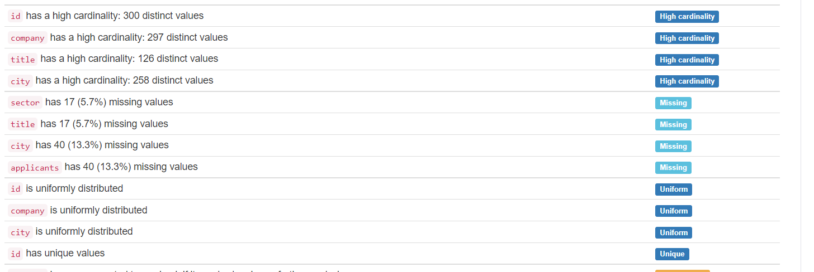
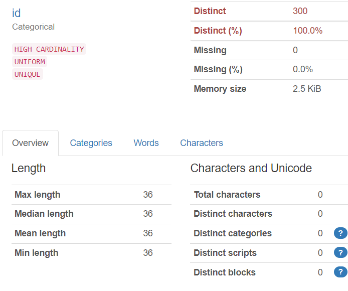
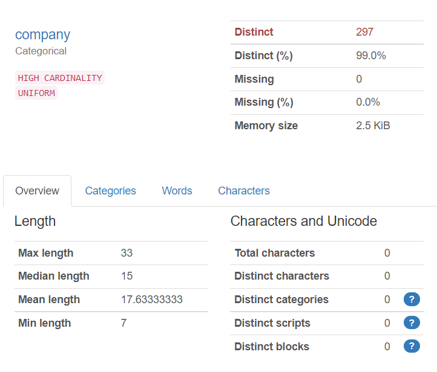
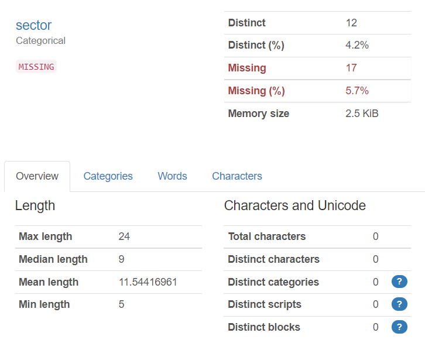
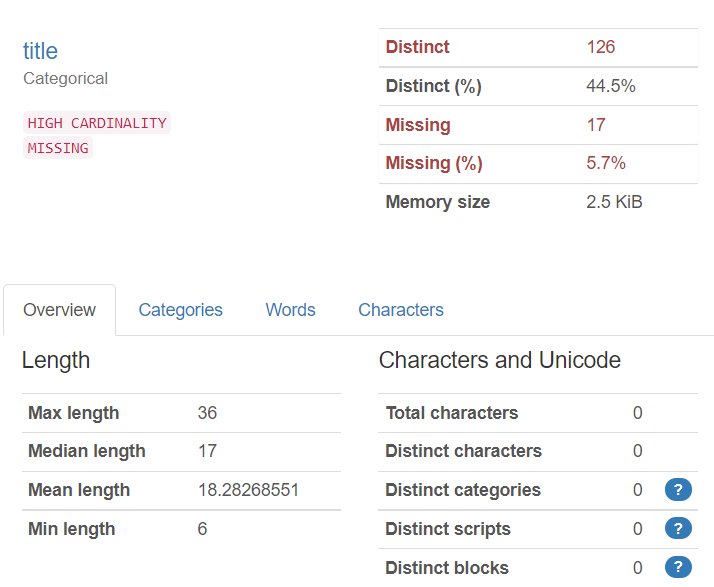
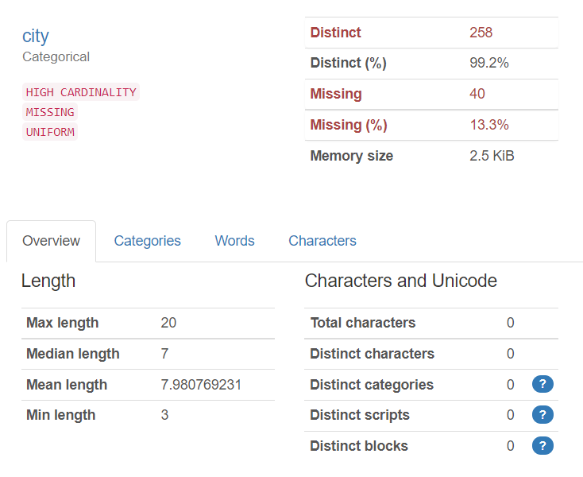
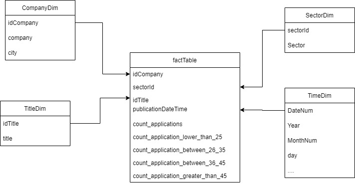
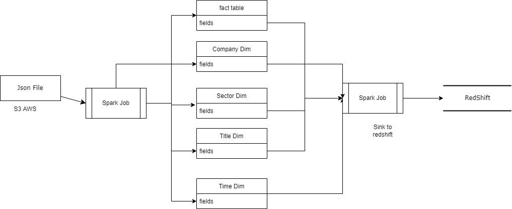

##Data Profiling

## Data Dictionary

### Fact Table

| Field                             |                   Description                   | Type    |
|-----------------------------------|:-----------------------------------------------:|:--------|
| idCompany                         |                Company id field                 | Integer |
| sectorID                          |                 Sector id field                 | Integer |
| idTitle                           |                 Title id field                  | Integer |
| publicationDateTime               |               Date of application               | Integer |
| count_applications                |              number of application              | Integer |
| count_application_lower_than_25   |   number of application of ages lower than 25   | Integer |
| count_application_between_26_35   | number of application of ages between 26 and 35 | Integer |
| count_application_between_36_45   | number of application of ages between 36 and 45 | Integer |
| count_application_greater_than_25 |  number of application of ages grater than 45   | Integer |

### CompanyDim

| Field     | Description      | Type    |
|-----------|:-----------------|:--------|
| idCompany | company id field | Integer |
| company   | name of company  | String  |
| city      | city of company  | String  |

###SectorDim

| Field    | Description     | Type    | 
|----------|:----------------|:--------|
| sectorId | sector id field | Integer |
| sector   | name of sector  | String  | 

###TitleDim
| Field   | Description    | Type    |
|---------|:---------------|:--------|
| idTitle | title id field | Integer | 
| title   | name of title  | String  |

###TimeDim
| Field    | Description | Type    |
|----------|:------------|:--------|
| DateNum  | id of date  | Integer |
| year     | year        | Integer |
 | MonthNum | month       | Integer |
 | day      | day         | Integer |

##Data Modeling Diagram

## Flow of the process 
The process takes the job file as a source and is used as a foundation to create the dimension and
the fact tables (except the time dimension that has a different source). The pipeline read the base file
and create one by one the dimensions needed by the data modeling, once all the dimensions have been created
the **jobFactTable** creates the fact table using the dimensions previously created and the source file.

##Folder Structure
 The process contains the following folder taxonomy
- Resources : Contains the base data file used by the process as a source
- Dimension : Contains the objects that create the dimension for the models taking as a source the data frame resulting from the reading of the base JSON file 
- Fact : Contains the process that build the fact table
- Model : Contains the models of the objects used by the process
- Job : Contains the main class that execute the whole process 
